# El-mania

El-mania is an e-commerce website based on the B2C (Business to Customers) type. Customers can purchase products to address their needs using single-payment transactions. The online retailer is facilitating the purchase of a vast range of electronics, from video games, cables, and batteries to mobile devices, laptops, and appliances. 
El-mania's website is designed to offer a pleasant and effortless shopping experience to individual customers with the end-user in mind.

The fictional El-mania company is Swedish-based.
## User Stories

- As a **site user** I want to **register myself on an account** so that **I can have a personal account and view my profile**.
- As a **site user** I want to **authenticate myself** so that **I can see my account details**.
- As a **site user** I want to **search for products by name** so that **I can find the ones I want to purchase**.
- As a **site user** I want to **quickly get a list of relevant search results** so that **I can decide if the desired product is available**.
- As a **site user**, I want to **filter a specific category** so that **I can find the best-priced from a category**.
- As a **site user** I want to **view the range of products** so that **I can select some to purchase**.
- As a **site user** I want to **view images and details for each product** so that **I can have all the information needed in order to decide over a product**.
- As a **site user**, I want to **see products displayed page by page** so that **I can easily navigate to the next or previous page**.
- As a **site user** I want to **see the number of products in my cart** so that **I keep track of my purchase**.
- As a **site user** I want to **check the items in my bag** so that **I look over the final amount and details for each item**.
- As a **site user** I want to **submit my credit card details and get authorization** so that **I can complete my checkout**.
- As a **site user** I want to **feel that my payment and personal details are secure** so that **I can provide the requested information to place a order**.
- As a **site user** I want to **have a personal user profile** so that **I can see my past orders and save my payment information**.
- As a **site user** I want to **receive an email confirmation after checkout** so that **I can see that my order is being handled**.
- As a **site user**, I want to **contact the company via form** so that **I conveniently can reach the company**.

These user stories are part of the agile tools used for this project. In order to integrate issues and pull requests, GitHub Projects was used.

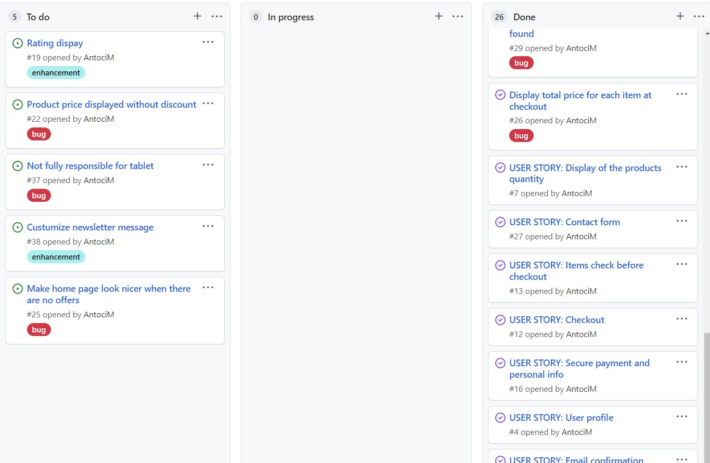

## Wireframes

- Home page 

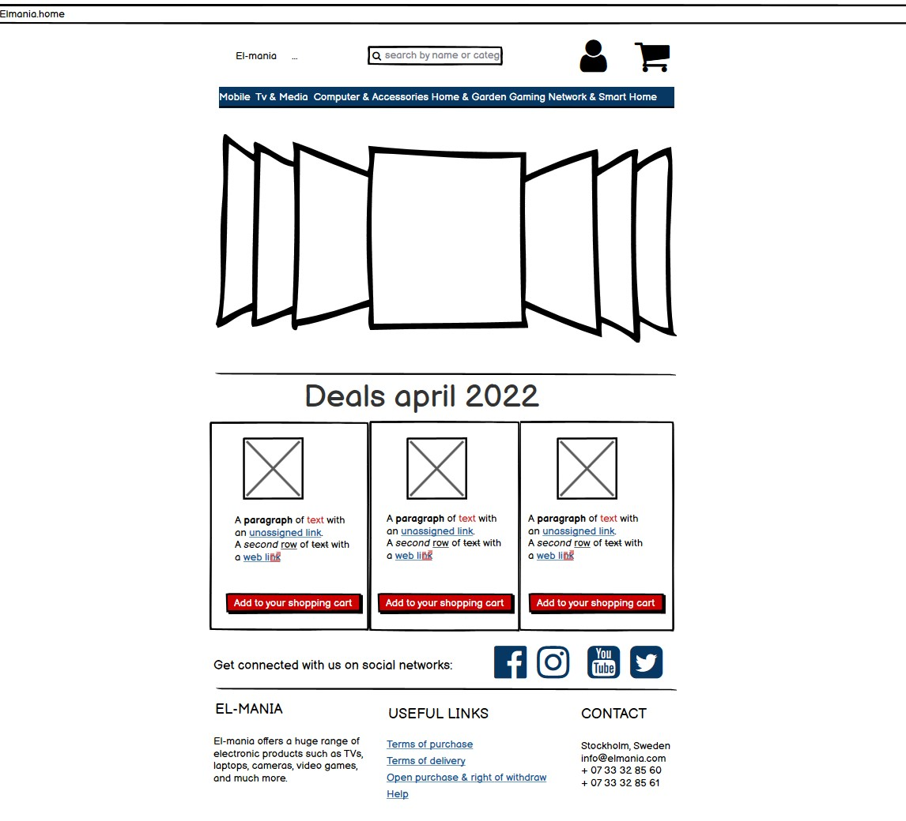

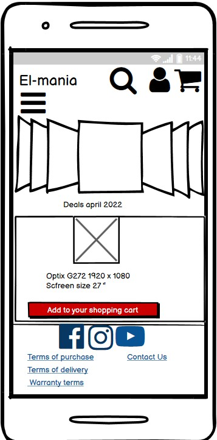

- Product page

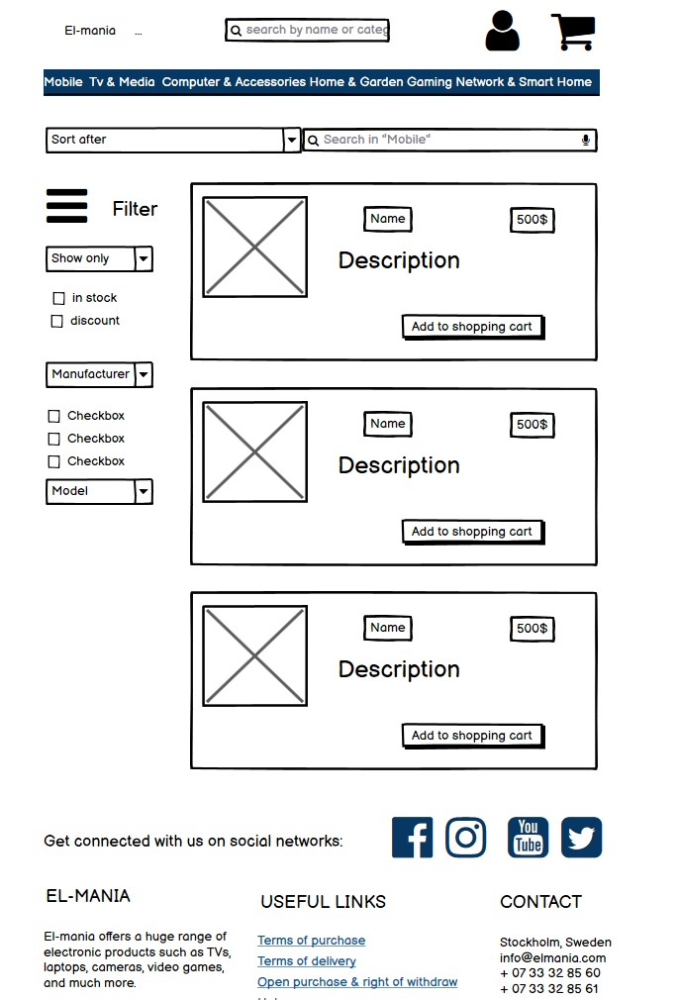

- Shopping cart page

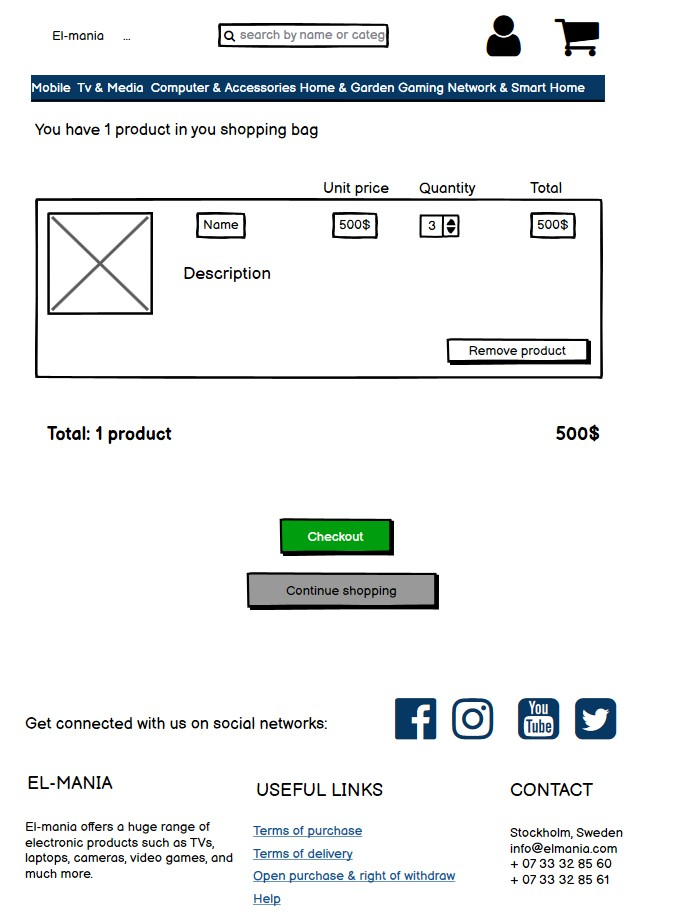

Some design changes come up during the development process. 
## Site Structure

The application has some main pages: Home, Products, Product-detail page, Terms of sale, Open purchase, Privacy Policy, Shopping Cart, Checkout. It also has several additional pages related to Admin and accounts.

## Design Choices

The design is modern and straightforward, with a sharp edge. The main goal is to maintain client focus on shopping and be as intuitive as possible, making users' interaction with the website fast and simple. 
### Color Scheme

The color pallet has contrasting and vibrant colors. The red and green accents are used as intuitive visual hints for `delete` and `add to cart` buttons, as well as to display discounted prices and badges. 

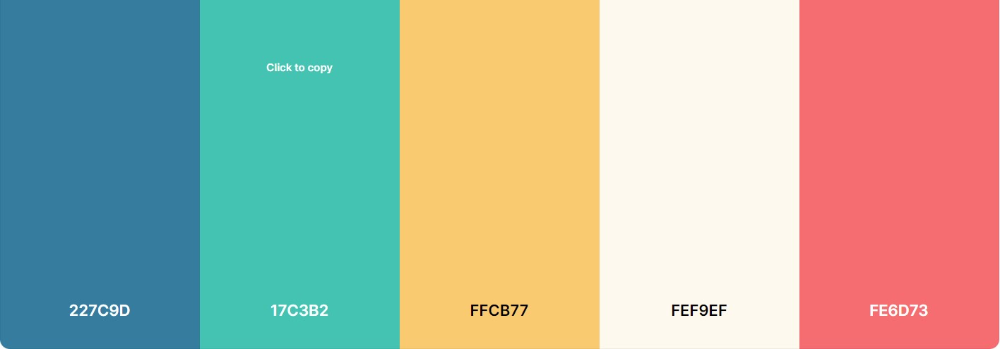

## Data Model

El-mania's website is based on the MVC model (Model. View and Controller). It consists of a database with relationships between models (represented by tables in the above image). The models are User, Item, ItemDiscount, CartItem, Order, OrderItems, and Contact. The views then render the models in a way dictated by the URLs.

Some fields have been altered during the development process, and new models have been created: UserProfile and UserContact.

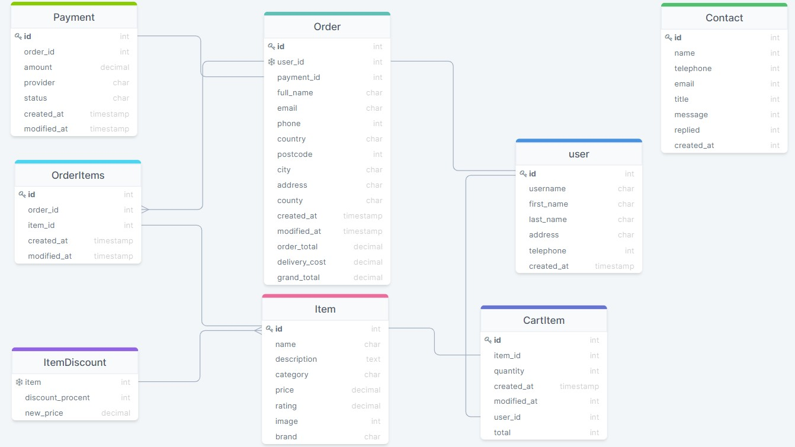

## Features
### Existing features
#### Home Page
##### Navigation 

El-mania's navigation is located at the top of every page, under a banner with shipping cost info. 

The top header has:

- company's logo on the left-hand side;
- search bar located in the middle where users can search after wished product by name or category;
- icons for Login, Login Admin, and Cart in the right corner, displayed inline. When a user is authenticated, a My Profile and a Logout icon show up to make user interaction explicit. The Cart icon has a product-counter badge. 

Main navigation consists of links for the entire list of products, Cell Phones, Tv and Home Theater, Computer $ Tablets, Video Games, Hausehold.

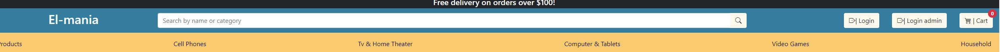

The main navigation elemets swifts to a dropdown list for smaller screens, represented by three lines in the top left corner.

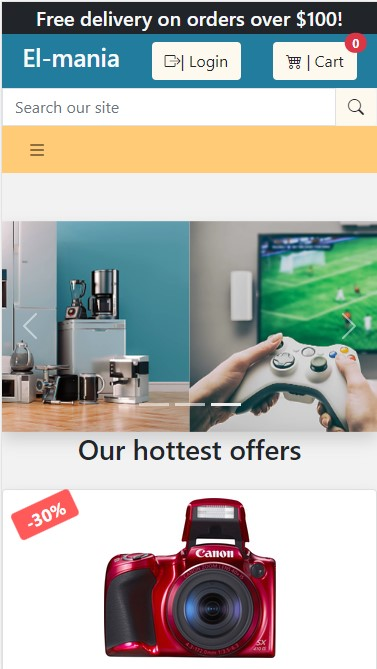

##### Carousel Images

 A slideshow for cycling through a series of 3 images is a point of interest, with some sales or campaigns taking place.

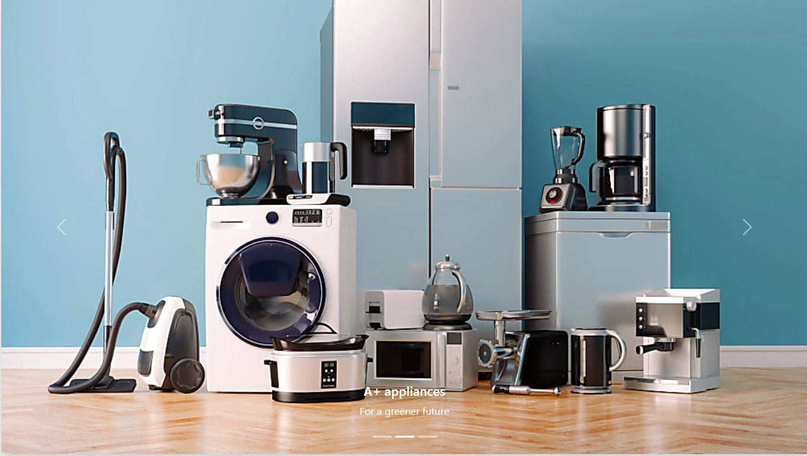

##### Offers Cards

Bootstrap card presenting discounted products. Each card has information for one product. Image, name, price, discounted price, discounted percent on the left corner. At the bottom are two buttons, `add to cart` and `details`. 

`Add to cart` will add that product to the shopping cart, while `Details` will open a product-detail page with more information on that product. 

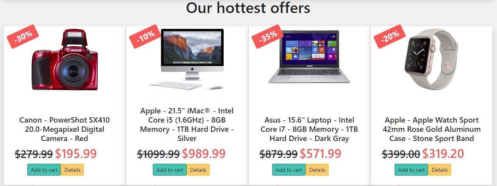

##### Footer

Located at the page bottom. It has three sections:

1. social media section is redirecting the user to El-mania's Facebook page and other social media pages (El-mania does not have business pages on this website).
2. in the second section:
- is embedded in a signup form to the company's newsletter. 
A list of Useful Links redirects the user to Terms to sale, Open purchase, and Privacy policy pages to increase the client's reliability. 
- company's contact details, followed by a button to the client form. 
3. Copywrite information 

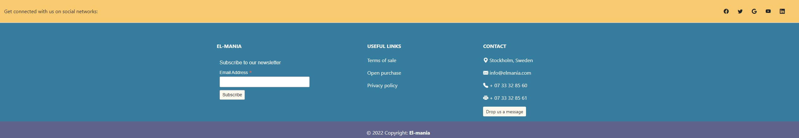

#### Products

The Products page displays all the products that are registered in the database. On each page are displayed 25 products. Navigation between those pages is made using the pagination from the bottom of the page. 

Each product is presented on a card with an image on the left side, name, and rating in the middle, and on the right-side unit price and two options: `Add to cart` and `Details`. 

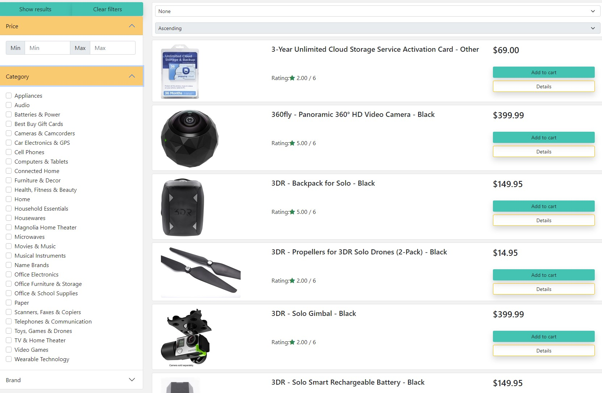

On this page, the user can sort the products based on **name, rating, and price**, **ascending or descending**. 

The left sidebar is dedicated to filtering: 
- by price: the user can set a minimum and maximum value. 
- by category: the user can check one or multiple categories from a dropdown list.
- by brand: the user can select one or multiple manufacturers.

To complete these actions, the user must click on `Show results`. The matching results are displayed. `Clear filters` will remove the selected filters. 

When no result is found, an info message will be displayed.

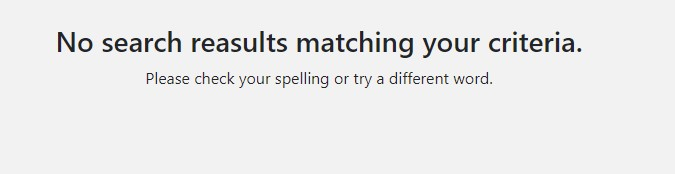

 

## Generating Fixtures

The products data in the database is created by uploading pre-written data from a file using fixtures in JSON format. To read and filter the dataset using Python, conversion of JSON into their respective Python objects was needed.

https://github.com/algolia/datasets 

https://www.geeksforgeeks.org/read-json-file-using-python/

Links:

https://fmhelp.filemaker.com/help/18/fmp/en/index.html#page/FMP_Help%2Fmany-to-many-relationships.html%23

https://www.bootdey.com/snippets/view/Shop-cart#html  Shopping cart code

