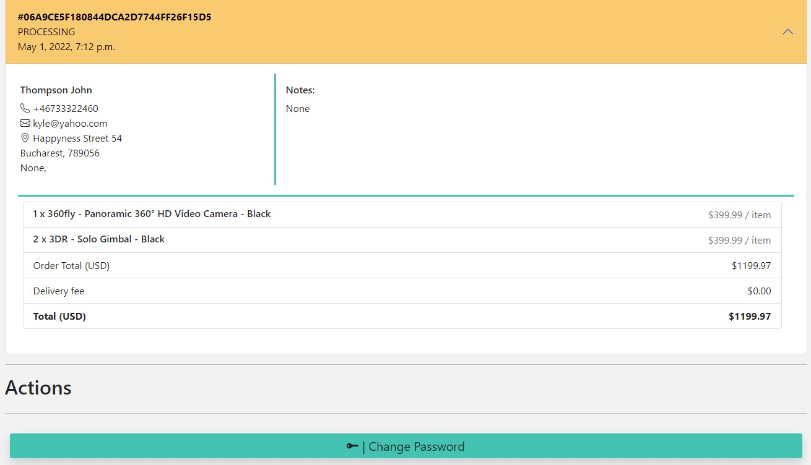

# El-mania

El-mania is an e-commerce website based on the B2C (Business to Customers) type. Customers can purchase products to address their needs using single-payment transactions. The online retailer is facilitating the purchase of a vast range of electronics, from video games, cables, and batteries to mobile devices, laptops, and appliances.
El-mania's website is designed to offer a pleasant and effortless shopping experience to individual customers with the end-user in mind.

The fictional El-mania company is Swedish-based.

Live demo can be found on [Heroku](https://el-mania.onrender.com)

## User Stories

- As a **site user** I want to **register myself on an account** so that **I can have a personal account and view my profile**.
- As a **site user** I want to **authenticate myself** so that **I can see my account details**.
- As a **site user** I want to **search for products by name** so that **I can find the ones I want to purchase**.
- As a **site user** I want to **quickly get a list of relevant search results** so that **I can decide if the desired product is available**.
- As a **site user**, I want to **filter a specific category** so that **I can find the best-priced from a category**.
- As a **site user** I want to **view the range of products** so that **I can select some to purchase**.
- As a **site user** I want to **view images and details for each product** so that **I can have all the information needed in order to decide over a product**.
- As a **site user**, I want to **see products displayed page by page** so that **I can easily navigate to the next or previous page**.
- As a **site user** I want to **see the number of products in my cart** so that **I keep track of my purchase**.
- As a **site user** I want to **check the items in my bag** so that **I look over the final amount and details for each item**.
- As a **site user** I want to **submit my credit card details and get authorization** so that **I can complete my checkout**.
- As a **site user** I want to **feel that my payment and personal details are secure** so that **I can provide the requested information to place a order**.
- As a **site user** I want to **have a personal user profile** so that **I can see my past orders and save my payment information**.
- As a **site user** I want to **receive an email confirmation after checkout** so that **I can see that my order is being handled**.
- As a **site user**, I want to **contact the company via form** so that **I conveniently can reach the company**.
- As an **admin** I want to **add new products** so that **I keep the brand relevant to customers**.
- As an **admin**, I want to **edit product information presented on the website** so that **I can keep the customers updated and well-informed**.
- As an **admin** I want to **delete products from the store** so that **I can effortlessly remove old products**.

These user stories are part of the agile tools used for this project. In order to integrate issues and pull requests, GitHub Projects was used.

## Wireframes

- Home page

- Product page

- Shopping cart page

Some design changes come up during the development process.

## Site Structure

The application has some main pages: Home, Products, Product-detail page, Profile, Shopping Cart, Checkout, Terms of sale, Open purchase, Privacy Policy and a custom 404 error page. It also has several additional pages related to Admin and accounts.

## Design Choices

The design is modern and straightforward, with a sharp edge. The main goal is to maintain client's focus on shopping and to be as intuitive as possible, making client's interaction with the website fast and simple.
### Color Scheme

The color pallet has contrasting and vibrant colors. The red and green accents are used as intuitive visual hints for `delete` and `add to cart` buttons, as well as to display discounted prices and badges.

## Data Model

El-mania's website is based on the MVC model (Model. View and Controller). It consists of a database with relationships between models (represented by tables in the above image). The models are User, Item, ItemDiscount, CartItem, Order, OrderItems, and Contact. The views then render the models in a way dictated by the URLs.

Some fields have been altered during the development process, and new models have been created: UserProfile and UserContact.

## Features
### Existing features

#### Role-based Authorisation functionality

This e-commerce platform presents functionality elements for Admin, logged-in users, and guests (shoppers without an account).

When logged in, the `Admin` can see, add, edit and delete products in the store. These operations can be performed only by the Admin using a series of buttons from the products page and product detail page. The usual buttons for customers are disabled for the Admin.
The admin can also access the Django Admin Panel.

A logged-in `user` has access to his own `Profile`. On the Profile page, the user can save/update his contact information, see order history, and change his account password.

A site's `guest` has access to the store and can place an order without authentication. Guests will be updated via email.
#### Home Page
##### Navigation

El-mania's navigation is located at the top of every page, under a banner with shipping cost info.

The top header has:

- company's logo on the left-hand side;
- search bar located in the middle where users can search after wished product by name or category;
- icons for Login, and Cart in the right corner, displayed inline. When a user is authenticated, a My Profile and a Logout icon show up to make user interaction explicit. The Cart icon has a product-counter badge.

Main navigation consists of links for the entire list of products, Cell Phones, Tv & Home Theater, Computer & Tablets, Video Games, Hausehold.

The main navigation elements swifts to a dropdown list for smaller screens, represented by three lines in the top left corner.

##### Carousel Images

 A slideshow for cycling through a series of 3 images is a point of interest. Ongoing sales or marketing campaines are displayed on the representative images.

##### Offers Cards

Bootstrap card presenting discounted products. Each card has information for one product. Image, name, price, discounted price, discounted percent on the left corner. At the bottom are two buttons, `add to cart` and `details`.

`Add to cart` will add that product to the shopping cart, while `Details` will open a product-detail page with more information on that product.

##### Footer

Located at the page bottom. It has three sections:

1. social media section is redirecting the user to El-mania's Facebook page and other social media pages (El-mania does not yet have business pages on other social platforms).
2. in the second section:
- is embedded in a signup form to the company's newsletter.
- A list of Useful Links redirects the user to Terms to sale, Open purchase, and Privacy policy pages to increase the website's reliability.
- company's contact details, followed by a button to the client form.
3. Copywrite information

#### Products

The Products page displays all the products that are registered in the database. On each page are displayed 25 products. Navigation between those pages is made using the pagination from the bottom of the page.

Each product is presented on a card with an image on the left side, name, and rating in the middle, and on the right-side unit price and two options: `Add to cart` and `Details`.

On this page, the user can sort the products based on **name, rating**, and **price**, **ascending** or **descending**.

The left sidebar is dedicated to filtering:
- by price: the user can set a minimum and maximum value.
- by category: the user can check one or multiple categories from a dropdown list.
- by brand: the user can select one or multiple manufacturers.

To complete these actions, the user must click on `Show results`. The matching results are displayed. `Clear filters` will remove the selected filters.

When no result is found, an info message will be displayed.

#### Product Detail

On click `Details` button from each presentation card will redirect the user to a product-detail page, where the user can read a short description of the product, see name, price, category, rating. The user can choose the next action, `Keep shopping` - redirect to previous page or `Add to cart` - add this product to the cart.

#### Shopping Cart

The shopping cart page is accessed from the right-based cart icon. Here the client can:

- see all items added to the cart.
- adjust the quantity by direct input in the field or by pressing the increase or decrease arrows. `Update cart` button will recalculate the subtotal displayed.
- delete a product by pressing `Remove` button
- see the product's total price. Each item is added to this amount.
- continue to the next step in the shopping process by clicking on `Proceed to Checkout`.

#### Checkout

- **Shipping Address** is an order form that the user must fill out to proceed to payment. Here a website's guest can fill up the name, email, telephone, address, city, postal code, county, and country (select from the list).

   An authenticated user can select from his registered shipping address.

- **Your cart** is a summary of the order. Quantity, product name, and amount for that product are displayed inline. *Order Total* is the products' total. *Delivery fee* is 0 for orders over 100$. If an order is under this amount, a delivery fee of 10$ will be applied. *Total* is the sum of the order total and delivery fee.

#### Payment

The secure payment formalities are implemented with Stripes. The user can choose to pay by card or using Google Pay. Card payment requirements are card number, expiration date, three-digit security code, and country.

If the user selects Pay new instructions will appear after submitting his order.

After clicking on `Pay now`, if the transaction is successful, the user will receive a message, followed by a confirmation email. An error message will appear for an unsuccessful payment.

#### Profile

An authenticated user has access to his profile. The profile page has three dropdown sections.
- The first section includes a form where a user can save default **shipping details**(e.g, home address, office, or another place where wishes to receive orders). This information will appear on the checkout without needing to complete the checkout form.
    The user can update or delete one registered address.

- The second section is **Order history**. A user can see the order number, status, order date, delivery address, and order summary for each order.

- The 3rd section gives the user the possibility to change his password. `Change Password` will redirect to the reset password page, and the user will receive instructions via email.

#### Contact form

Contact form includes name, email, telephone, title, and message. When a user submits a contact request, the application logs the contact to the database for a record. Initially, all messages are marked as 'unreplied'. A quick reference to see the contact's status.

#### Additional pages

The user is redirected to different pages from AllAuth accounts.

- Sign in: the user can log in using his credentials, username/email, and password. There is a link to the Sign up form in the case of a new user.
- Password reset: to recover the forgotten password.
- Email verification: every new user will receive a verification email to finalize the signup process.

#### Admin Panel

Admin has access via the default Django Admin page. The Admin panel is accessed from the navigation menu (Admin link) once a superuser has logged in. Admin can add/delete users, upload/delete products, and see the contact received via contact form. The admin can manually change the order status from `processing` to `delivered`.

### Future Feature

- Automatic notification for the user when an order has a new status.
- Possibly for the user to upload a profile picture and change credentials.
- Order status to be more detailed. Now are available only 2.
- Information on delivery at checkout.

## Generating Fixtures

The product data in the database is created by uploading pre-written data from a file using fixtures in JSON format. To read and filter the dataset using Python, conversion of JSON into their respective Python objects was needed.

## SEO Implementations

To improve accessibility for El-mania, a series of techniques were implemented:

- `meta` tags description, keyword
-  added xml-sitemap and robots.txt
-  added alt tags for `img`

## Marketing

To increase visibility for potential clients, El-mania is using Social Media Marketing. This presents the advantage of being free of charge and offers the possibility of creating close relationships with customers.

El-mania has a Facebook business page, as presented in the image above. The link to the page can be accessed from the footer, Facebook icon.
Facebook is the most popular social media platform, with a significant representation worldwide. They are also offering the possibility of paid ads, which aligns with El-mania's marketing strategy for the future.

## Technologies used

- Python - the primary language of the application.
- HTML5 - provides the content and structure for the website.
- CSS - provides the styling.
- Django - Django framework for the project.
- Heroku - For project deployment.
- Bootstrap - Design toolkit.
- GitHub - to host the repositories.
- Gitpod - as the IDE for the application.
- Balsamiq - used to create the wireframes.
- Cloudinary - used for image storage.
- PEP8 - for testing and validating the code.
- W3C Validator - code validation.
- DrawSQL - for the database diagram.
- XML - sitemap.
- Privacy Policy Generator
## Credits

- [Shutterstoc](https://www.shutterstock.com/) for images.
- [Coolors](https://coolors.co/palettes/trending) for genereting color scheme.
- [StackOverflow](https://stackoverflow.com/) for generals ideas.
- [This](https://stackoverflow.com/questions/19130942/whats-the-best-way-to-store-a-phone-number-in-django-models) for phone number model.
- [Google Fonts](https://fonts.google.com/) for font.
- [Ordinarycoders](https://ordinarycoders.com/blog/article/build-a-django-contact-form-with-email-backend) for contact form ideas.
- [Code with Mosh](https://codewithmosh.com/p/the-ultimate-django-part1) for more info om MVC.
- [Footer template](https://mdbootstrap.com/docs/standard/navigation/footer/)
- [Code institute - Boutique Ado](https://kika-boutique-ado.herokuapp.com/) for code examples and ideas.
- [Dataset](https://github.com/algolia/datasets )
- [This](https://stackoverflow.com/questions/62679372/django-post-save-not-firing-but-post-delete-in-same-signals-py-file-does) was used for fixing a bug.
- [Geeksforgeeks](https://www.geeksforgeeks.org/error_messages-django-form-field-validation/) for form validation.
- [This](https://www.geeksforgeeks.org/read-json-file-using-python/) for creating fixtures.
- [For MVC Model](https://fmhelp.filemaker.com/help/18/fmp/en/index.html#page/FMP_Help%2Fmany-to-many-relationships.html%23)
- [Template](https://www.bootdey.com/snippets/view/Shop-cart#html) for shopping cart page.

## Testing

Please refer to [here](Testing.md) for more information on testing.

## Deployment
### To deploy using Heroku:

- Ensure your requirements.txt file has the required dependencies.
- Create or Login to your Heroku account.
- Navigate to Dashboard.
- "Create new app" from the drop-down menu. This is found in the upper right portion of the window.
- Provide a unique name for your application and select your region.
- Click "Create App".

#### Heroku Postgres database:
- Navigate to the "Resources" tab. Once there, in the search box type "Postgres".
- Conect this to the App you have just created.

#### Setting up the App within Heroku:
- Navigate to "Settings" and scroll down to "config vars".
- There are several config vars for this project:

#### App deployment

- Navigate to the "Deploy" section.
- Scroll down to "Deployment Method" and select "GitHub".
- Authorise the connection of Heroku to GitHub.
- Search for your GitHub repository name, and select the correct repository.
- For Deployment, there are two options, Automatic Deployments or Manual.
- Automatic Deployment: This will prompt Heroku to re-build your app each time you push your code to GitHub.
- Manual Deployment: This will only prompt Heroku to build your app when you manually tell it.
- Select "master/Main", and the deployment method that you desire.

#### Fork repository on GitHub

- Log in to GitHub and locate the repository.
- Click on the 'Fork' button (located on the left-hand side) to create a copy of the original repository in your GitHub Account.

#### Local clone of a project

- Under the repository's name, click on the code tab.
- In the Clone with HTTPS section, click on the clipboard icon to copy the given URL. Cloning image
- In your IDE of choice, open Git Bash.
- Change the current working directory to the location where you want the cloned directory to be made.
- Type git clone, and then paste the URL copied from GitHub.
- Press 'enter', and the local clone will be created.

## Acknowledgements

The site was completed as a Portfolio 5 Project piece for the Full Stack Software Developer (e-Commerce) Diploma at the Code Institute. I want to thank my mentor Precious Ijege for his support and feedback.

