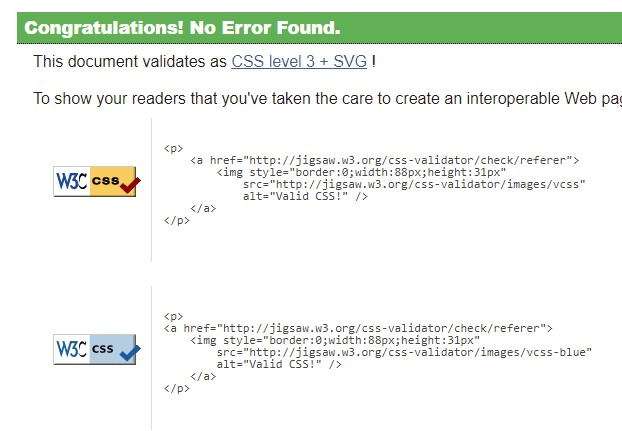
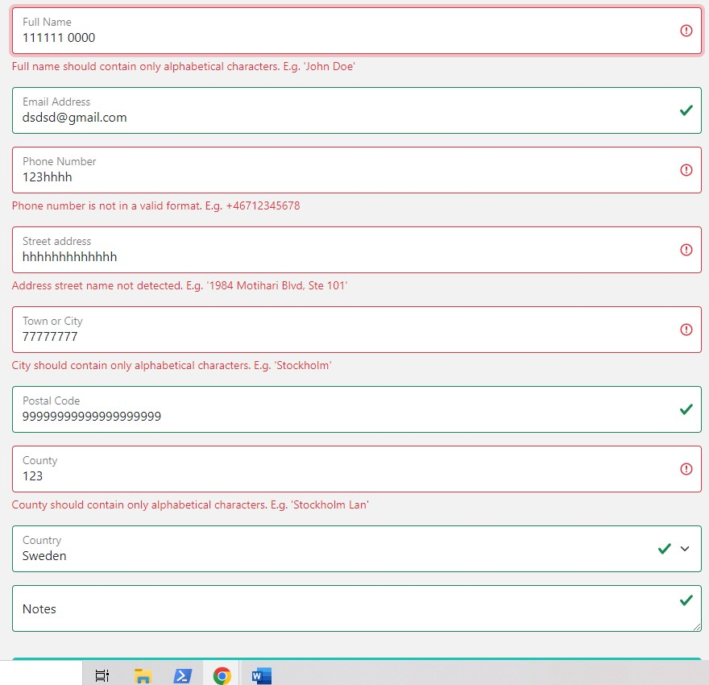

## Code verification

El mania e-commerce application has been manually tested. All the code has been run through the W3C HTML validator, the W3C CSS validator, and the PEP8 linter for python code. The code passed the W3C Validator with all the Django template tags. Outside of that, no errors were reported. 

PEP8 linter showed some errors which were fixed. Remaining some E501 errors.

### Lighthouse 

This tool was used to test the performance and accessibility, and it provided helpful information to improve accessibility and SEO during the creation process. Here are the final results:

### Responsivness

The responsive design tests were carried out manually with Google Chrome DevTools.

### Compatibility

The website was tested on Chrome, Edge, Mozilla Firefox. The functionality and appearance remain unchanged between these three on any device size.
### Manual Testing

The testing targeted especially form fields input. 

1.  Validation was added to the **order form**, where the user is filling out his personal information. 

- full name, city, country validate only alphabethical characters and space.
- address field must contain only alphanumeric characters.
- phone number is validating only numbers, with a standard format.

Validation errors messages are displayed when invalid data input, when user is clicking `Payment`.

2. **Shipping information** form has the same validation criteria applied for phone, address, city, county. A error message is displayed in the left corner, for user to check the form.

A future improvment at these forms can be instant validation, so the user can see the error before alle fields are completed.

3. The adjust quantity button on the shopping cart page, does not validate a negative input. A info message is displayed.

4. The `min` field for price filter on product page does not validate negative values and `max` price must be grater than the minimum price input.

### Fixed Bugs 

During the development process, a series of errors popped up.

- ConnectionReffusedError (error 111) when trying to accees the SignUp. This was solved by setting validation email =’none’.

- Documented in GitHub issues are other fixed bugs. See: #13, #15, #16

### Known Issues

At this moment, there are two open bugs on GitHub issues. The display of multiple messages in the dashboard and the email notification are not working
#14 and #17

