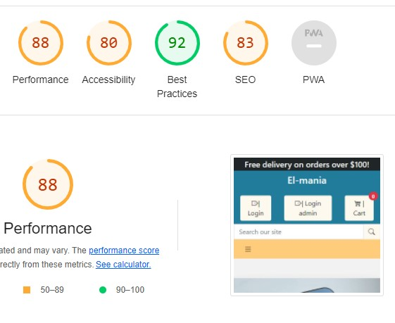

## Testing user stories

1. As a **site user** I want to **register myself on an account** so that **I can have a personal account and view my profile**.

    - On the home page, there is a link to a Login. Here the new user can submit a form to register. A verification email will be sent to complete the sign-up procedure.

2. As a **site user** I want to **authenticate myself** so that **I can see my account details**.

   -  After registering and email verification, the user can log in anytime by clicking on the `Login` button. After checking credentials, the user has access to the profile.

3. As a **site user** I want to **search for products by name** so that **I can find the ones I want to purchase**.

    - At the top of every page is a search bar where the user can search by name or category. After that, he can select the wished product. 
Deleting the search criteria will list products randomly.

4. As a **site user** I want to **quickly get a list of relevant search results** so that **I can decide if the desired product is available**.

    - A search criteria will display only products in that category. If there is no matching results, a display message will pop up.

5. As a **site user**, I want to **filter a specific category** so that **I can find the best-priced from a category**.

    - On the left-hand side of the Products page there is a dropdown `Category` field. Here the user can select one or more categories from the list displayed. Results will be shown when the `Search result` button is clicked. Descending and ascending prices from that category will be displayed when `price` and `ascending`/`descending` radio buttons are selected, right above where products are displayed.

6. As a **site user** I want to **view the range of products** so that **I can select some to purchase**.

    - On the menu, there is a link to the Products page. On click, all products will be displayed.

7. As a **site user** I want to **view images and details for each product** so that **I can have all the information needed in order to decide over a product**.

    -  `Details` button near each product will open a new page with more information on that product. The same will happen on the shopping cart page by clicking the name or image.

8. As a **site user**, I want to **see products displayed page by page** so that **I can easily navigate to the next or previous page**.

    - A number indicating the currently displayed page, previous and next is shown at the page bottom. Based on the search criteria applied, up to 25 products will show. 

9. As a **site user** I want to **see the number of products in my cart** so that **I keep track of my purchase**.

    - On the right corner of every page is displayed a cart icon with a number badge. When the user adds a product to the cart, the number is updated.

10. As a **site user** I want to **check the items in my bag** so that **I look over the final amount and details for each item**.

    - By clicking the `Cart` icon, a list of all products, details and subtotal are displayed.

11. As a **site user** I want to **submit my credit card details and get authorization** so that **I can complete my checkout**.

    - By clicking `Payment` at checkout, the user can submit a form with his credit card details. A message will inform if the transaction succeeded or not.

12. As a **site user** I want to **feel that my payment and personal details are secure** so that **I can provide the requested information to place a order**.

    - Payment is handled by Stripes, which provides secure payment services online.

13. As a **site user** I want to **have a personal user profile** so that **I can see my past orders and save my payment information**.

    - In the menu, the user can access `My Profile`. There will be Order History, registered address, and the possibility to change the password.

14. As a **site user** I want to **receive an email confirmation after checkout** so that **I can see that my order is being handled**.
   
    - When a purchase is completed, the user will receive an email with the order number and more information.

15. As a **site user**, I want to **contact the company via form** so that **I conveniently can reach the company**.

    - At the bottom of the page, where is contact information, the user can send a message to the company by filling out that form.
## Code verification

El-mania e-commerce application has been manually tested. All the code has been run through the W3C HTML validator, the W3C CSS validator, and the PEP8 linter for python code. The code passed the W3C Validator with all the Django template tags. Outside of that, no errors were reported. 

PEP8 linter showed some errors, which were fixed—remaining some E501 errors.

### Lighthouse 

This tool was used to test the performance and accessibility, and it provided helpful information to improve accessibility and SEO during the creation process. Here are the final results:

### Responsivness

The responsive design tests were carried out manually with Google Chrome DevTools.

### Compatibility

The website was tested on Chrome, Edge, Mozilla Firefox. The functionality and appearance remain unchanged between these three on any device size.
### Manual Testing

The testing targeted especially form fields input. 

1. Validation was added to the **order form**, where the user fills out his personal information. 

- full name, city, country  fields validate only alphabetical characters and space.
- address field must contain only alphanumeric characters.
- phone number is validating only numbers, with a standard format.
When a user clicks `Payment` button, the validation error messages are displayed. 

2. **Shipping information** form has the same validation criteria for phone, address, city, and county. An error message is displayed in the left corner for the user to check the form.

Future improvements in these forms can be instant validation, so the user can see the error before the entire form is filled.

3. The adjust quantity button on the shopping cart page does not validate a negative input. An info message is displayed.

4. The `min` field for the price filter on the products page does not validate negative values, and `max` price must be greater than the minimum price input.

### Fixed Bugs 

During the development process, a series of errors popped up.

- Documented in GitHub issues are some fixed bugs. See: #17, #20, #23, #26, #28, #29, #30, #31, #32, #33, #36. 

### Known Issues

At this moment, there are two open bugs on GitHub issues - #22 and #37, and three enhancement issues #19, #25, #38.  

